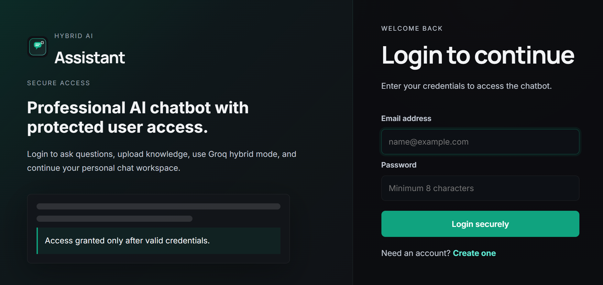
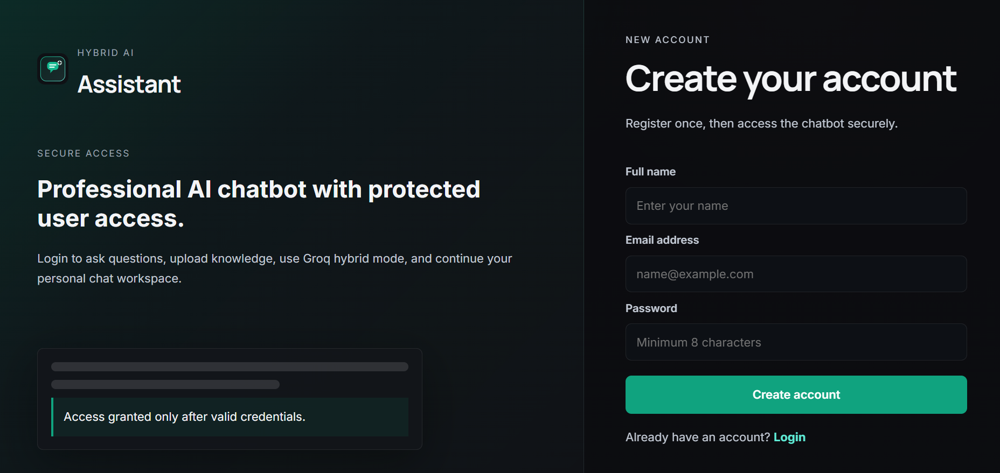
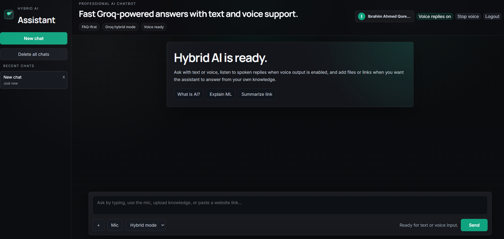
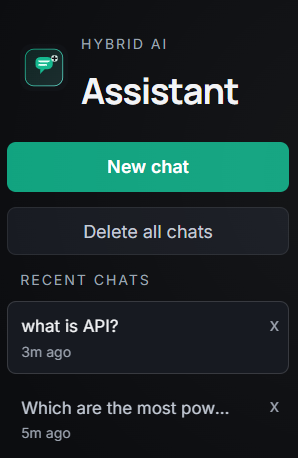
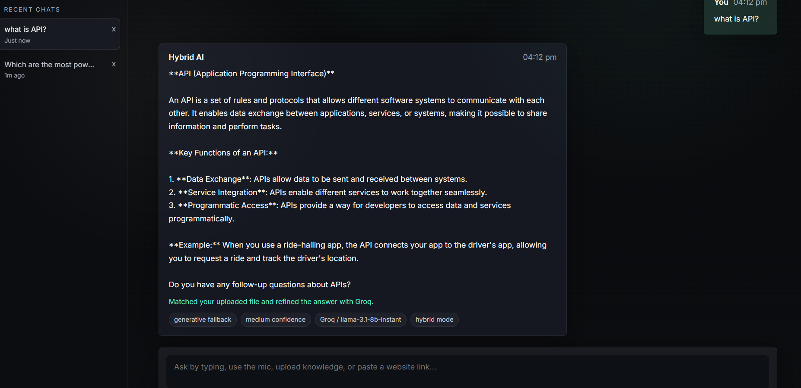
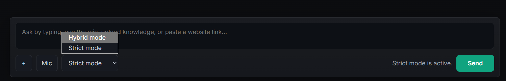

# Hybrid AI FAQ Virtual Assistant

Hybrid AI FAQ Virtual Assistant is a professional Flask-based chatbot that combines three response strategies in one experience:

- `FAQ-first retrieval` from a trusted CSV dataset
- `Strict document-grounded answering` from uploaded knowledge files
- `Hybrid RAG + Groq generation` for broader natural-language responses

It is designed to feel like a modern AI product while staying practical for academic demos, portfolio projects, and lightweight real-world assistants.

## Overview

This project gives users a dark, modern chatbot interface with:

- secure login and signup
- text and voice input
- optional voice output
- strict mode for grounded answers only
- hybrid mode for smarter Groq-powered answers
- retrieval from uploaded files and stored knowledge
- persistent browser-side chat history

The assistant always tries to use your trusted data first. If the answer is not confidently available in the FAQ or uploaded knowledge, hybrid mode can use Groq to produce a more natural answer with retrieved context.

## Screenshots

### Authentication

#### Login Page
<p align="center">
  
</p>

#### Signup Page
<p align="center">
  
</p>

---

### Main Interface

#### Dashboard UI
<p align="center">
  
</p>

#### Chat History Sidebar
<p align="center">
  
</p>

#### AI Response View
<p align="center">
  
</p>

#### Mode Selection
<p align="center">
  
</p>

## Key Features

- `Authentication system`
  - Sign up and log in before accessing the chatbot
  - Session-based authentication
  - Local hashed user storage in `data/users.json`

- `Hybrid answering pipeline`
  - FAQ matching from `faq_data.csv`
  - Strict retrieval from uploaded knowledge
  - Groq fallback for hybrid mode
  - Knowledge-first behavior before generation

- `Multi-format knowledge ingestion`
  - CSV
  - JSON
  - TXT
  - PDF
  - DOCX
  - Manual text
  - Website URL content

- `Voice experience`
  - Microphone-based voice input in supported browsers
  - Transcript review before sending
  - Optional spoken responses with browser speech synthesis
  - Stop-voice control during playback

- `Modern chat experience`
  - Sidebar with chat history
  - New chat and delete chat controls
  - Strict/hybrid mode switching
  - Upload actions inside the composer
  - Professional dark UI with responsive layout

## How It Works

When a user asks a question, the app follows this flow:

1. The system checks for a strong FAQ match from `faq_data.csv`.
2. It searches indexed knowledge from uploaded or ingested sources.
3. In `strict` mode, it answers only from FAQ or retrieved source content.
4. In `hybrid` mode, it sends retrieved context to Groq when generation is needed.
5. If provider access is unavailable, the app returns a safe grounded fallback instead of crashing.

## Tech Stack

### Backend

- Python
- Flask
- scikit-learn
- pandas
- httpx
- pypdf

### Frontend

- HTML
- CSS
- JavaScript

### AI / Retrieval

- CSV-based FAQ retrieval
- TF-IDF similarity search
- Document-grounded strict answering
- Retrieval-Augmented Generation with Groq

## Project Structure

```text
Hybrid_AI/
|-- app.py
|-- core/
|   `-- config.py
|-- services/
|   |-- auth_service.py
|   |-- groq_service.py
|   `-- hybrid_service.py
|-- static/
|   |-- logo.svg
|   |-- script.js
|   `-- style.css
|-- templates/
|   |-- auth.html
|   `-- index.html
|-- data/
|   `-- knowledge_store.json
|-- data_loader.py
|-- knowledge_base.py
|-- rag_engine.py
|-- run_server.py
|-- faq_data.csv
|-- requirements.txt
|-- Procfile
|-- vercel.json
|-- .vercelignore
`-- .env.example
```

## Setup

### 1. Clone the repository

```bash
git clone <your-repository-url>
cd Hybrid_AI
```

### 2. Create and activate a virtual environment

On Windows:

```bash
python -m venv .venv
.venv\Scripts\activate
```

On macOS or Linux:

```bash
python3 -m venv .venv
source .venv/bin/activate
```

### 3. Install dependencies

```bash
pip install -r requirements.txt
```

### 4. Create your environment file

Create a `.env` file in the project root using `.env.example` as a guide:

```env
GROQ_API_KEY=your_groq_api_key_here
GROQ_MODEL=llama-3.1-8b-instant
GROQ_BASE_URL=https://api.groq.com/openai/v1
SESSION_SECRET=replace_with_a_long_random_secret
```

### 5. Run the application

Development mode:

```bash
python app.py
```

Production-style local mode on Windows, Linux, or macOS:

```bash
python run_server.py
```

Open the app in your browser:

```text
http://127.0.0.1:5000
```

## Deployment

This project is structured to be deployment-friendly.

### Cross-platform support

The project is designed to run on Windows, Linux, and macOS. It uses `pathlib` and Python's temp directory handling for portable file paths, and `waitress` is used as a cross-platform production server.

Use the same dependency command on every operating system:

```bash
pip install -r requirements.txt
```

### Vercel

The project includes `vercel.json` so Vercel can route requests to `app.py`. The dependency list is intentionally Linux-safe and does not include Windows-only packages such as `pywin32`, `pypiwin32`, or desktop-only voice packages.

On Vercel, runtime JSON files are written to the serverless temp directory instead of the deployed project folder. This prevents serverless function crashes caused by read-only filesystem writes. For permanent production login accounts, connect a hosted database such as PostgreSQL, MySQL, MongoDB, or Supabase.

### Environment variables

Set these in your deployment platform:

- `GROQ_API_KEY`
- `GROQ_MODEL`
- `GROQ_BASE_URL`
- `SESSION_SECRET`
- `PORT` if required by the platform

### Procfile

A `Procfile` is included for deployment workflows that support it.

### Recommended notes

- Use a strong `SESSION_SECRET` in production.
- Keep `.env`, `data/users.json`, and any private knowledge files out of Git.
- Serve the app over `HTTPS` in production for the best browser voice support.
- For long-term production use, replace local JSON user storage with a hosted database.

## API Endpoints

### Public

- `GET /health`
  - Returns service health and Groq configuration status

### Auth-protected

- `POST /api/ask`
  - Submit a chatbot question
- `GET /api/knowledge`
  - View knowledge base statistics
- `POST /api/knowledge`
  - Upload files, manual text, or website content
- `POST /logout`
  - End the current session

### Example request

```json
{
  "question": "Explain machine learning in simple words.",
  "history": [],
  "mode": "hybrid"
}
```

## Supported Knowledge Sources

The chatbot can ingest and retrieve from:

- `CSV` files
- `JSON` files
- `TXT` files
- `PDF` documents
- `DOCX` documents
- manually entered text
- website links

These sources become part of the searchable knowledge base and can be used by both strict and hybrid modes.

## Browser Notes

- Voice input works best in `Chrome` or `Edge`
- Voice input usually requires `localhost` or `HTTPS`
- Voice output uses the browser speech synthesis engine, so no extra server-side TTS package is required

## Security Notes

- Never commit your real `.env` file
- Rotate API keys if they were exposed publicly
- `data/users.json` is local-only and should stay ignored
- Uploaded knowledge may contain private content, so handle it carefully in shared environments

## Use Cases

This project is a strong fit for:

- university final-year projects
- AI portfolio showcases
- internal knowledge assistants
- FAQ automation demos
- document-based virtual assistant prototypes

## Future Improvements

Possible next upgrades include:

- database-backed user management
- per-user private knowledge spaces
- richer admin dashboard
- cloud storage for uploads
- model/provider switching from settings
- citations with source highlighting
- automated tests and CI

## Author

Built as a hybrid intelligent AI assistant project with retrieval, document grounding, voice interaction, authentication, and modern chat UX.
